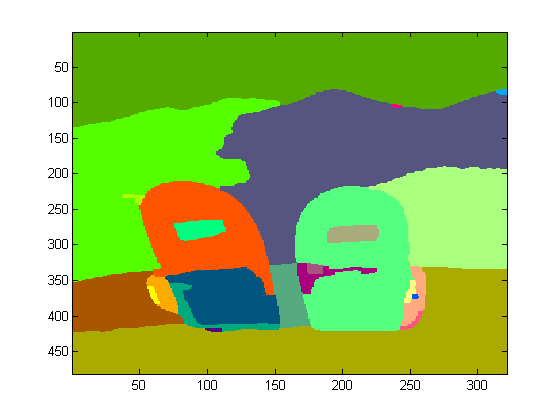

# Segmentation practice

## Data


The data for this lab can be downloaded from the course server using http:

- http://157.253.63.7/Lab5Images.tar.gz

## Creating a  basic segmentation method

Implement your own segmentation method using what you have learned in class. It should be a matlab/python function with the following signature:

Matlab
```matlab
function segmentation = segmentByClustering( rgbImage, featureSpace, clusteringMethod, numberOfClusters)
```

Python
```python
def segmentByClustering( rgbImage, featureSpace, clusteringMethod, numberOfClusters):
    ...
    return segmentation
```
Where

- featureSpace : 'rgb', 'lab', 'hsv', 'rgb+xy', 'lab+xy' or 'hsv+xy'
- clusteringMethod = 'k-means', 'gmm', 'hierarchical' or 'watershed'.

The output of the function should be an  matrix with the same withd and  height of the original image and only one channel, where each pixel has a cluster label. In other words, pixels that belong to the same cluster should have the same positive integer label.


### Notes
- You dont have to implemente all the code from scratch, use the built in functions of your language.
- If you run into memory problems try scaling down the images. 
- *xy* stands for the spatial _x_ and _y_ coordinates.
- You may need to normalize some channels to make them comparable, or to make some of them more/less important in the clustering process. For example _newCoords = ( α\*r, α\*g, α\*b, β\*x, β\*y)_


## Test your function

Before testing your function make sure the segmentation results are acceptable. To visualize the output of your function use something like:

```matlab
image(segm)
colormap colorcube
```

You should see an image similar to the following, where each color represents a different cluster.



Try different parameters of your function, and inspect them visually before actually testing them.


### Reading ground truth data

The file 'Lab5Images.tar.gz 'contains the segmentation ground truth data. It has the same name as the image file and is saved as matlab file (.mat). The mat file contains several manual segmentation created by human annotators.

For example, lets look at the ground truth for image ``train/22090`` we can use the following code

```matlab
gt=load('BSDS500/data/groundTruth/train/55075.mat')
% Load segmentation from first human
segm=gt.groundTruth{1}.Segmentation;
image(segm)
colormap colorcube

% create a new figure
figure
% Boundaries from first human
bound=t.groundTruth{1}.Boundaries;
image(bound)
colormap flag
```

Feel free to use/implement any evaluation strategy for your segmentation function. Just remeber there is more than a single ground truth for any given iamge. 

#Your turn

The report for this laboratory must include:

-   Small (Max. one paragraph per method) description of the implemented clustering algorithms.
-   Did  you have to scale (up or down) any of the channesl (r,g,b,x,y). why?
-   Does it make sense to use other color spaces different from RGB?  why?
-   What segmentation method or color space seems to yield the best result, can you give some insight  on why?
-   Do you think any of the channels seems to be most discriminative?
-   The hyperparameter 'numberOfClusters', is probably the most important parameter in this problem, how can you choose it?
-   How can we evaluate a general segmentation problem?, is it diffreent if we have multiple ground truth?
-  What evaluation strategy did you choose, why?

Discuss the results
-  What are the limitations of the method?
-  Overall, what are the fail conditions of the implemented methods?
-  How could your method be improved?


